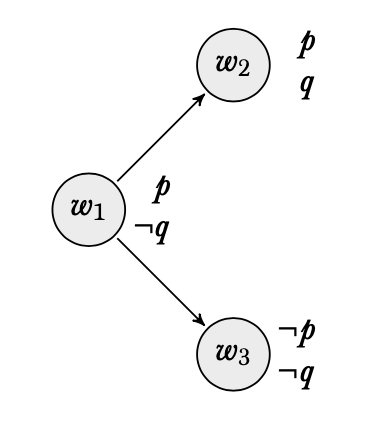
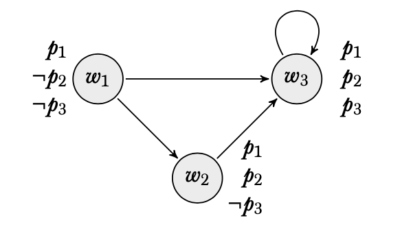

\newpage

## Questions 1-5

In the model pictured here, which worlds are the following sentences true at:

1. $p$
2. $q$
3. $\Box p$
4. $\Diamond p$
5. $\Box (p \rightarrow q)$

\vspace{75pt}

## Questions 6-10

In the model pictured here, which worlds are the following sentences true at:

6. $p_2$
7. $\Box(p_1 \rightarrow p_2)$
8. $\Box p_2 \rightarrow p_2$
9. $\Box \Diamond p_3$
10. $\Box p_3 \vee \Box \neg p_3$