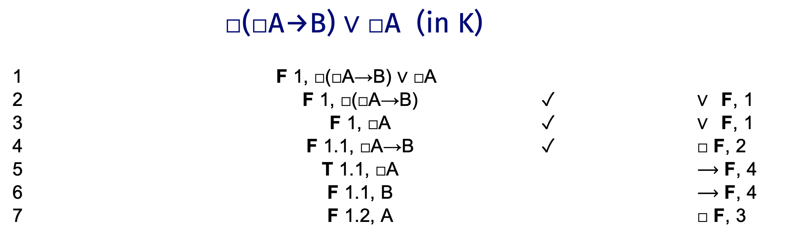

## Truth Tables

For each of these sequents, do a truth table to test whether they are valid. In each case, say whether they are valid.

1. $A \vee B, B \rightarrow A \vDash A$ - **VALID**

\begin{tabular}{@{ }c@{ }@{ }c | c@{ }@{ }c@{ }@{ }c@{ }@{ }c@{ }@{ }c | c@{ }@{ }c@{ }@{ }c@{ }@{ }c@{ }@{ }c | c}
A & B &  & A & $\lor$ & B &  &  & B & $\rightarrow$ & A &  & A\\
\hline 
T & T &  & T & \textcolor{red}{T} & T &  &  & T & \textcolor{red}{T} & T &  & \textcolor{red}{T}\\
T & F &  & T & \textcolor{red}{T} & F &  &  & F & \textcolor{red}{T} & T &  & \textcolor{red}{T}\\
F & T &  & F & \textcolor{red}{T} & T &  &  & T & \textcolor{red}{F} & F &  & \textcolor{red}{F}\\
F & F &  & F & \textcolor{red}{F} & F &  &  & F & \textcolor{red}{T} & F &  & \textcolor{red}{F}\\
\end{tabular}

2. $\neg (A \wedge B), \neg (B \rightarrow A) \vDash A$ - **INVALID**

\begin{tabular}{@{ }c@{ }@{ }c | c@{ }@{}c@{}@{ }c@{ }@{ }c@{ }@{ }c@{ }@{}c@{ } | c@{ }@{}c@{}@{ }c@{ }@{ }c@{ }@{ }c@{ }@{}c@{ } | c}
A & B & $\lnot$ & ( & A & $\land$ & B & ) & $\lnot$ & ( & B & $\rightarrow$ & A & ) & A\\
\hline 
T & T & \textcolor{red}{F} &  & T & T & T &  & \textcolor{red}{F} &  & T & T & T &  & \textcolor{red}{T}\\
T & F & \textcolor{red}{T} &  & T & F & F &  & \textcolor{red}{F} &  & F & T & T &  & \textcolor{red}{T}\\
F & T & \textcolor{red}{T} &  & F & F & T &  & \textcolor{red}{T} &  & T & F & F &  & \textcolor{red}{F}\\
F & F & \textcolor{red}{T} &  & F & F & F &  & \textcolor{red}{F} &  & F & T & F &  & \textcolor{red}{F}\\
\end{tabular}

3. $A \rightarrow B \vDash B \rightarrow A$ - **INVALID**

\begin{tabular}{@{ }c@{ }@{ }c | c@{ }@{ }c@{ }@{ }c@{ }@{ }c@{ }@{ }c | c@{ }@{ }c@{ }@{ }c@{ }@{ }c@{ }@{ }c}
A & B &  & A & $\rightarrow$ & B &  &  & B & $\rightarrow$ & A & \\
\hline 
T & T &  & T & \textcolor{red}{T} & T &  &  & T & \textcolor{red}{T} & T & \\
T & F &  & T & \textcolor{red}{F} & F &  &  & F & \textcolor{red}{T} & T & \\
F & T &  & F & \textcolor{red}{T} & T &  &  & T & \textcolor{red}{F} & F & \\
F & F &  & F & \textcolor{red}{T} & F &  &  & F & \textcolor{red}{T} & F & \\
\end{tabular}

\newpage

4. $A \rightarrow (B \vee C), C \rightarrow (A \vee B) \vDash B$ - **INVALID**

\begin{tabular}{@{ }c@{ }@{ }c@{ }@{ }c | c@{ }@{ }c@{ }@{ }c@{ }@{}c@{}@{ }c@{ }@{ }c@{ }@{ }c@{ }@{}c@{}@{ }c | c@{ }@{ }c@{ }@{ }c@{ }@{}c@{}@{ }c@{ }@{ }c@{ }@{ }c@{ }@{}c@{}@{ }c | c}
A & B & C &  & A & $\rightarrow$ & ( & B & $\lor$ & C & ) &  &  & C & $\rightarrow$ & ( & A & $\lor$ & B & ) &  & B\\
\hline 
T & T & T &  & T & \textcolor{red}{T} &  & T & T & T &  &  &  & T & \textcolor{red}{T} &  & T & T & T &  &  & \textcolor{red}{T}\\
T & T & F &  & T & \textcolor{red}{T} &  & T & T & F &  &  &  & F & \textcolor{red}{T} &  & T & T & T &  &  & \textcolor{red}{T}\\
T & F & T &  & T & \textcolor{red}{T} &  & F & T & T &  &  &  & T & \textcolor{red}{T} &  & T & T & F &  &  & \textcolor{red}{F}\\
T & F & F &  & T & \textcolor{red}{F} &  & F & F & F &  &  &  & F & \textcolor{red}{T} &  & T & T & F &  &  & \textcolor{red}{F}\\
F & T & T &  & F & \textcolor{red}{T} &  & T & T & T &  &  &  & T & \textcolor{red}{T} &  & F & T & T &  &  & \textcolor{red}{T}\\
F & T & F &  & F & \textcolor{red}{T} &  & T & T & F &  &  &  & F & \textcolor{red}{T} &  & F & T & T &  &  & \textcolor{red}{T}\\
F & F & T &  & F & \textcolor{red}{T} &  & F & T & T &  &  &  & T & \textcolor{red}{F} &  & F & F & F &  &  & \textcolor{red}{F}\\
F & F & F &  & F & \textcolor{red}{T} &  & F & F & F &  &  &  & F & \textcolor{red}{T} &  & F & F & F &  &  & \textcolor{red}{F}\\
\end{tabular}

## Truth Trees

For each of these sequents, do a truth table to test whether they are valid. In each case, say whether they are valid.

5. $A \vee B, B \rightarrow A \vDash A$

6. $\neg (A \wedge B), \neg (B \rightarrow A) \vDash A$

7. $A \rightarrow B \vDash B \rightarrow A$

8. $A \rightarrow (B \vee C), C \rightarrow (A \vee B) \vDash B$

\newpage

## Proofs

Construct a proof for each of the following

9. $P \rightarrow (Q \wedge R), S \wedge P \vdash R \wedge (S \vee T)$ 

10. $(P \wedge Q) \rightarrow R \vdash P \rightarrow (Q \rightarrow R)$

11. $P \rightarrow R, Q \rightarrow R \vdash (P \vee Q) \rightarrow R$

\newpage

12. $P \rightarrow (Q \wedge R), P \rightarrow (R \rightarrow \neg Q) \vdash \neg P$

## Probability

13. A fair coin (with equal chance of landing heads and landing tails) is about to be flipped. Ankita is offered the following bet - if it lands heads she wins $200, and if it lands tails she loses $100. Do we know enough to advise Ankita whether or not she should take the bet? Why or why not?

_We do not know enough. We need to know the utility of gaining $200 and of losing $100, and which of these is larger. The theory doesn't tell us these; it's up to her how much she values these things. So as it stands, we don't know enough to advise her_.

14. Explain why the following decision rule is not generally reasonable: Identity the most likely state; then choose an act which maximizes utility in that state. (Hint: Describe a situation where this would lead to doing something unreasonable.)

_Consider a choice with the following table, where state A has probability 0.6, and state B has probability 0.4._

Options     State A    State B
---------  ---------  ---------
Option X       1       -100000
Option Y       0           0

_The most likely outcome is A. And in A, X is the best option. But doing X is not in fact reasonable. Here is a real life case of this. You're driving, and the light ahead is red. There are cars on the cross street. But they aren't travelling fast, and if you just run the red light they'll probably stop. Probably. But running the light has a marginal gain, and if you're wrong about whether they'll stop, it would be catastrophic. You should stop, even though in the most likely state of the world (where the other cars avoid you), you would be (very slightly!) better off running the light._

## Modal Logic

For each of the following sentences, do **three** truth trees: one to check whether it is a logical truth in K, one to check whether it is a logical truth in S4, and one to check whether it is a logical truth in KT4B (i.e., S5). You can use the simplified rules for S5.

15. $\Box(\Box A \rightarrow B) \vee \Box A$

It is invalid in K.

It is invalid in S4.

It is valid in S5.

16. $\Diamond(A \rightarrow \Diamond \Box A)$

It is invalid in K.

It is valid in S4, and this tree also shows it is valid in S5.

## Conditionals

17. Show that $\Box (A \rightarrow B) \rightarrow \Box ((A \wedge C) \rightarrow B)$ is a theorem of S5.

\newpage

18. Describe a sphere model (from the minimal change semantics chapter of _Boxes And Diamonds_) that shows $((A \boxright B) \wedge (B \boxright C)) \rightarrow (A  \boxright C)$ is not a logical truth in the minimal change semantics.

_In words, here is a model. In the actual world, A, B, C are all false. The nearest world where A is true is 10 units away, and at it B is true and C is false. The nearest world where B is true is 5 units away, and at it A is false and C is true._

_Here is a picture that shows the same model. (You only need to do either a picture or a model. And any drawing that's clear will be fine - you don't need anything like these graphics.)_

