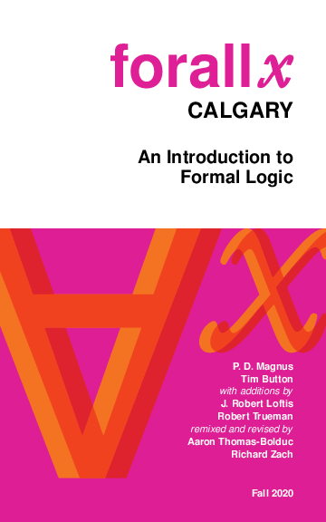
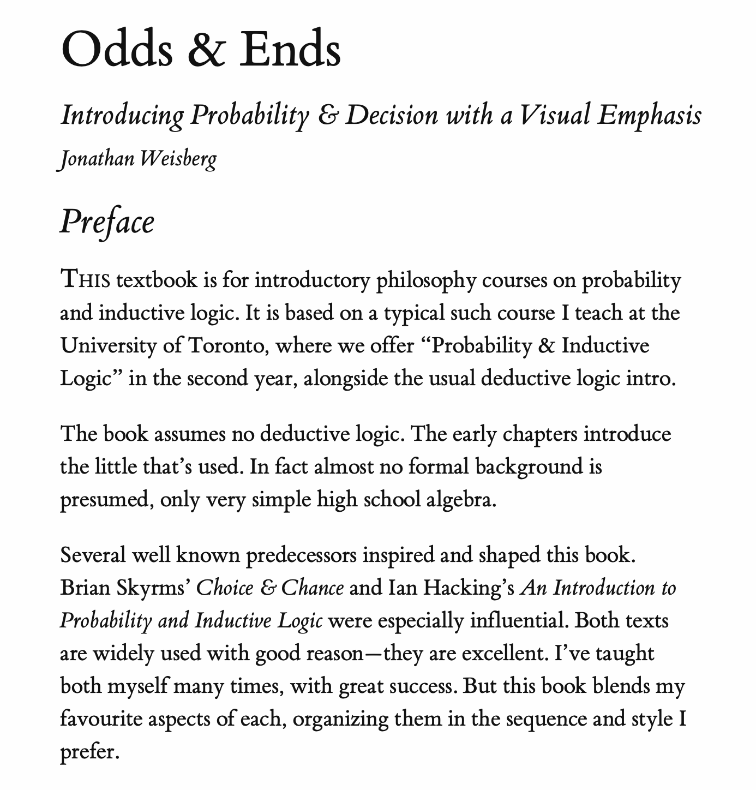
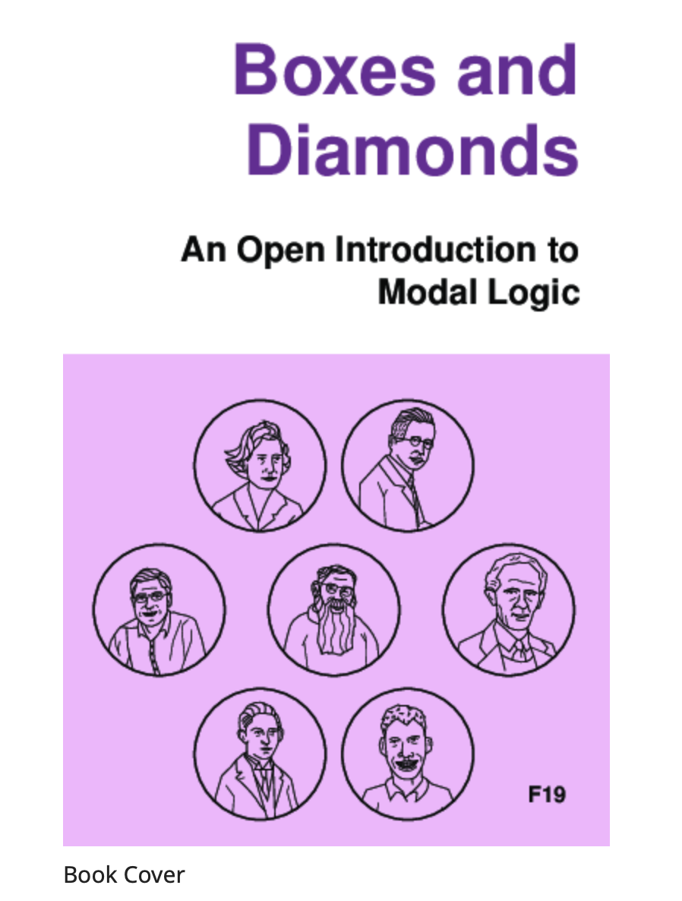

## Aim of Course

Introductory survey of some formal methods that are of broad philosophical use.

## Three Sections

> 1. Propositional Logic
> 2. Probability and Statistical Reasoning
> 3. Modal Logic and Conditionals

## Propositional Logic

- This is the logic of sentences that can be true or false, and that can combine to form longer sentences. 
- So as well as looking at simple sentences, like _Nadia sings_, we will look at sentences that are built from simple sentences.
- Examples of such sentences are _Nadia doesn't sing_, _Nadia sings and Bethany dances_, and _If Nadia sings, Simone sleeps_.

## Probability and Statistical Reasoning

> - Sometimes we can't infer that a conclusion is definitely true, but we can infer that it is probably true.
> - We will look at some tools for regimenting how and when we make such inference. 

## Modal Logic

This is the logic of 'must' and 'might'.  It has as many applications as there are interpretations of 'must' and 'might'. The primary interpretations we'll look at are:

> - Metaphysical 
> - Epistemological  
> - Moral 

## Textbooks

There are three - all of them available through Canvas.

1. _forall x: Calgary Edition_ by P. D. Magnus, Tim Button, J. Robert Loftis, Robert Trueman, Aaron Thomas-Bolduc and Richard Zach.
2. _Odds and Ends_ by Jonathan Weisberg
3. _Boxes and Diamonds, Ann Arbor remix_, written by Richard Zach and edited by me.

The three books are for the three parts of the course.

## forall x

{height=80%}

## Registering with Carnap

- To turn in the work for this part of the course, you have to register with a service called Carnap. 
- You'll find it at <http://carnap.io>.

## Register for the Right Course

Our course is called

> University of Michigan - W22 - Phil305    
>    
> University of Michigan Winter Term 2022 Philosophy 305 Introduction to Formal Methods

## Odds and Ends

{height=80%}

## Boxes and Diamonds

{height=80%}

---

{height=80%}

## Logistics

- These lectures are going to be very short.
- That's in part because it's really hard to retain focus through a long logic video, and in part because it's easier to manage uploads and downloads with smaller files.
- So we'll typically have somewhere between 6 and 10 'lectures' each week, though each will be 5 to 15 minutes.

## Access

- The slides will be captioned.
- The captions are produced automatically and they aren't always perfect.
- So if they can't be used.
- Access is important, and it's harder to get right for a course like this than for other philosophy courses, so you should hold me to a higher standard.

## Assessment

- The primary assessment will be weekly assignments, most of which will be administered through Canvas.
- Some of them, especially in the early weeks, will be on Carnap.
- These are already all posted, and they will be due each week on Friday at 5pm.
- There are exceptions for this week, the week after the mid-term break, and the last week of term.
- There will also be an end of term exam, also through Canvas.

## Syllabus

- The syllabus is available on Canvas. Indeed, it is the first thing that comes up when you load Canvas.
- Read it closely!!
- It will tell you what we're covering each week, and where you should be at over time.

## For Next Time

We'll start on saying what arguments are, in the special sense we're interested in.