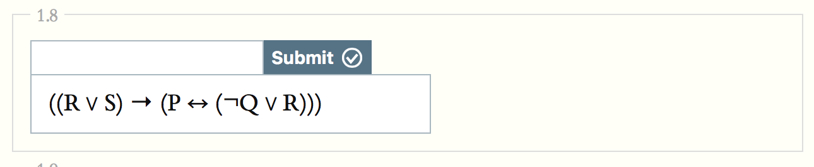
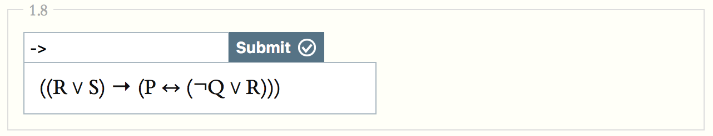
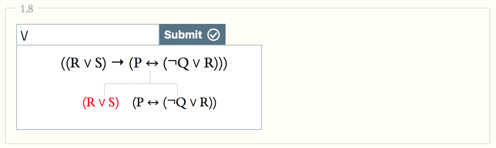
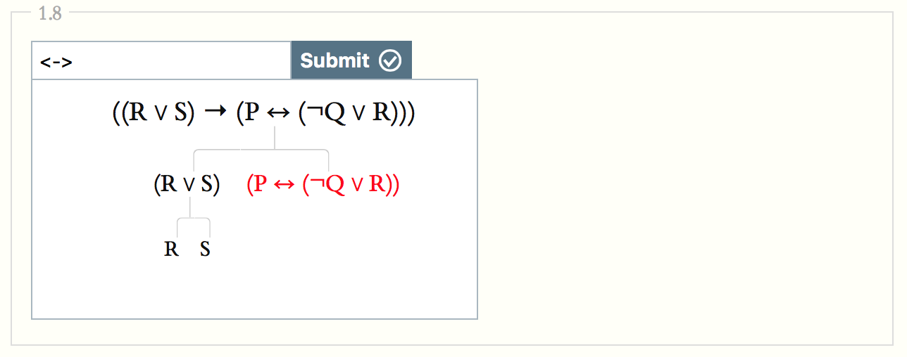
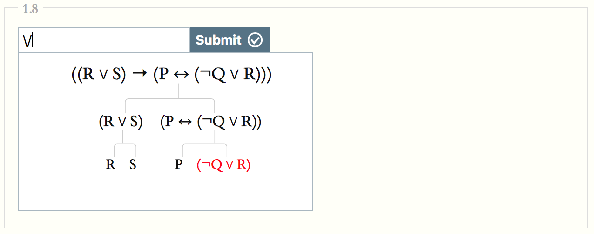
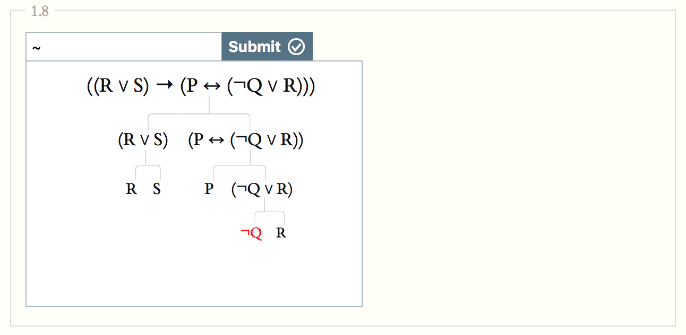

## Plan for This Lecture

- We're going to look at how and why we can iterate the translation procedures we've been investigating.

## Associated Reading

forall x, chapter 6, "Sentences of TFL"

## Recursion

The language of propositional logic has some fairly simple composition rules.

- It says what the basic sentences are.
- It has some rules saying that if some things are sentences, so are some other things.

The effect is that there are an infinity of possible sentences.

## Natural Language Recursion

As speakers of a human language, you're used to this kind of recursion. All of these are sentences.

> - It will rain.
> - Alex thinks that it will rain.
> - Kim thinks that Alex thinks that it will rain.
> - Alex thinks that Kim thinks that Alex thinks that it will rain.
> - And so on, to infinity, without adding any more words.

## Recursive Rule

 - If _S_ is a sentence, and _N_ is a name, then _N thinks that S_ is a sentence.
 - Note that the output of this rule can be the input to a new instance of it.
 
## Formal Language Recursion

- The letters $P, Q, R...$ are sentences.
- If _S_ and _T_ are sentences, then so are:

1. $\neg S$
2. $S \vee T$
3. $S \wedge T$
4. $S \rightarrow T$
5. $S \leftrightarrow T$

## Multiple Steps

So these are all sentences. (Note that I'm playing fast and loose with parentheses here.)

1. $P$
2. $Q$
3. $P \wedge Q$
4. $Q \rightarrow (P \wedge Q)$
5. $\neg P$
6. $Q \vee \neg P$
7. $(Q \rightarrow (P \wedge Q)) \leftrightarrow (Q \vee \neg P)$

The last one follows from the fact that 4 and 6 are sentences.

## Main Connective

For any sentence you can make, there will be a 'last step' in the demonstration that it is a sentence.

- That last step will involve copying down 1 or 2 other sentences, and adding a connective.
- On the previous slide, you copy down 4 and 6, and put a $\leftrightarrow$ between them.
- That connective you add is the **main connective** of the sentence.
- It covers all the material in the sentence.

## Main Connective

A binary connective is the main connective if (and only if) either side of it are two complete sentences.

> $P \wedge (Q \rightarrow R)$

The $\wedge$ is the main connective because either side of it are

- $P$
- $(Q \rightarrow R)$

And they are both sentences.

## Main Connective

A binary connective is the main connective if (and only if) either side of it are two complete sentences.

> $P \wedge (Q \rightarrow R)$

The $\rightarrow$ is not the main connective because either side of it are

- $P \wedge (Q$
- $R)$

And they are not both sentences.

## A Worked Example

## A Worked Example

## A Worked Example

## A Worked Example

## A Worked Example

## A Worked Example

## For Next Time

- We are going to start on how these connectives help us figure out the truth value of longer sentences.
- And we're going to use that to analyse arguments.