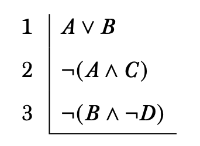

## Plan

This lecture introduces the basic idea of proofs

## Associated Reading

forall x, section 16.1.

## A Proof

::: columns

:::: column

::::

:::: column
- Starts with premises.
- In the system we're working in, these are offset by a horizontal line.
::::

:::

## A Proof

- A proof ends when you get to the sentence you were aiming for.
- This is different to tables, where you have to fill in everything.
- And it is different to trees, where you have to either close all branches, or tick all lines.
- Instead, proofs end when they have done their job.
- In most cases, you could continue; you just choose not to.

## Get To?

- How do we 'get' from premises to where we want to go?
- There are rules that allow us to generate new lines from old lines.
- The premises are lines we can use for this purpose, but they aren't the only ones.
- Indeed, once the proof starts, that horizontal line carving off premises from conclusions does very little work.

## Rules

- Mostly, the rules come in pairs, two for each connective.
- They will be called **introduction** and **elimination** rules.
- _Very_ roughly, the introduction rules are for when the connective appears in the desired conclusion, and the elimination rules are for when the connective appears in a premise.
- But this is only rough - the rules are just rules.

## Reiteration

- The first rule the book introduces, in 16.2, is one of the rare rules that is not an introduction or elimination rule.
- It says that you are allowed to repeat yourself.
- If a line appears somewhere, it can get repeated later.

## Why Reiteration

- It turns out it has some technical uses.
- But really it is mostly so we can make the arguments sound more like real life.
- In real arguments, if you argue for _p_, then three paragraphs later argue for _if p, q_, you might remind the audience that _p_, rather than just immediately infer _q_.
- That reminder is just reiteration.

## For Next Time

- We will look at 16.3, on the rules for 'and'.