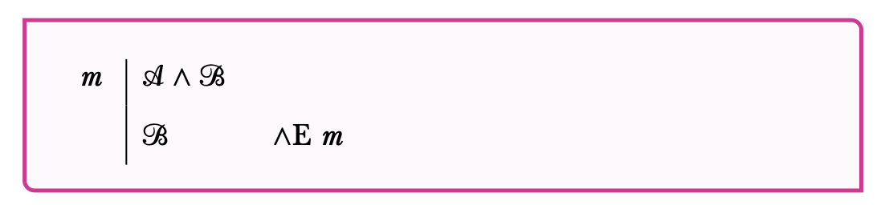

## Plan

This lecture introduces the two rules for $\wedge$.

## Associated Reading

forall x, section 16.3.

## Reasoning from And sentences

If you know that it snowed in Detroit and it snowed in Ann Arbor, there are two natural things you can infer. \pause

1. It snowed in Detroit. \pause
2. It snowed in Ann Arbor

## And-Elimination

- And-elimination, or $\wedge$E, is the formal version of the idea behind the last slide.
- It is in fact a pair of rules.
- The first says that from a conjunction you can infer the first conjunct.
- The second says that from a conjunction you can infer the second conjunct.

## And-Elimination the first

## And-Elimination the second

## A Key Constraint

- Just like with trees, these rules only apply to whole lines.
- So you can only apply $\wedge$E to a line if it has $\wedge$ as its **main connective**.
- Remember, $\wedge$ is the main connective if there is a well formed sentence either side of it.

## Reasoning to an And sentence

How might we prove a conjunctive sentence, say that it snowed in Detroit and it snowed in Ann Arbor? \pause There are a lot of ways we could do it, but the most obvious involves:

1. Proving that it snowed in Detroit.
2. Proving that it snowed in Ann Arbor.
3. Declaring victory.

## And-Introduction

- And-introduction, or $\wedge$I, is the formal version of the idea behind the last slide.
- It says that if you have a pair of sentences, you can infer the conjunction of those two sentences.
- It doesn't matter which order the sentences appear in the proof.

## And-Introduction

## A Proof

::: {.columns align=center}

:::: column

::::

:::: column
- This proof starts with one premise.
- The next four lines consist of taking that premise apart.
- And the next two consist of putting it back together, the way we want.
::::

:::

## Where We're At

- What I care about for now is that you understand how to read this proof.
- Figuring out how to construct a proof like this is harder, and that's something we'll spend a lot of time on next week.
- Natural deduction proofs should be much easier to read than to write.

## For Next Time

- We will look at 16.4, on the rules for 'if'.