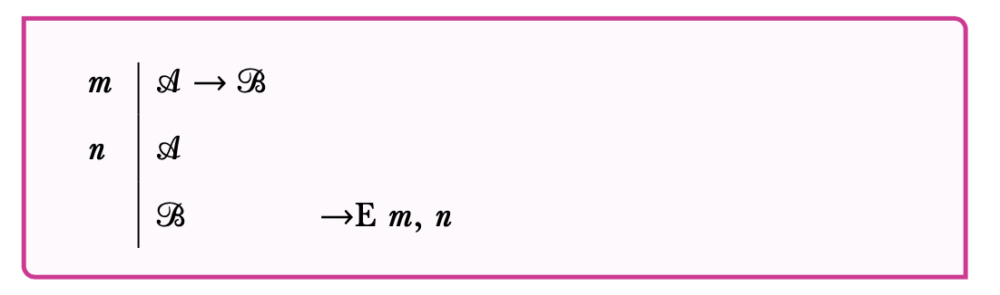
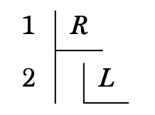
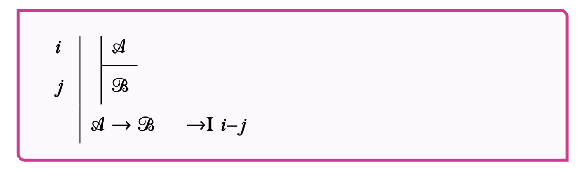

## Plan

This lecture introduces the two rules for $\rightarrow$.

## Associated Reading

forall x, section 16.4.

## Reasoning from If sentences

Here is the most basic kind of logical reasoning there is.

1. If it is snowing in Ann Arbor, then Brian is cold.
2. It is snowing in Ann Arbor.
3. So, Brian is cold.

## If-Elimination

- If-elimination, or $\rightarrow$E, is the formal version of the idea behind the last slide.
- It takes a pair of lines as input.
- One of those lines says $X \rightarrow Y$.
- The other says $X$.
- And you infer $Y$.

## If-Elimination

## Reasoning To an If-Sentence

- Here's one way to convince someone that _If A, B_ is true.
- Ask them to suppose, or imagine, or assume, that _A_ is true.
- Show that, given that supposition/imagination/assumption, we can infer that _B_ is also true.
- From the possibility of that kind of inference, infer _If A, B_ is true.

## If-Introduction

- If-introduction, or $\rightarrow$I, is the formal version of the idea behind the last slide.
- It says that if you make an assumption $A$, and infer $B$ from that assumption, you can conclude $A \rightarrow B$

## Assumptions

- So to do this we need to have a technique for making assumptions.
- The idea is that we indent the proof by a few spaces (to make clear that everything we do is suppositional), and put a line under the new assumption (to make clear what we're assuming).

## Assumptions

::: {.columns align=center}

:::: column

::::

:::: column
- In this proof, $R$ is the only premise.
- Then $L$ is an assumption.
- If we can get from $L$ to $X$, we can infer $L \rightarrow X$
::::

:::

## Discharging Assumptions

::: {.columns align=center}

:::: column

::::

:::: column
- Note that the last line is not indented.
- And there is a dash, not a comma, between the line numbers.
- We are back in the main proof, reasoning from the 'sub-proof'.
::::

:::

## If-Introduction

## For Next Time

- Next week we will start by looking in more detail at these subproofs, how they work, and what restrictions we have to put on them.