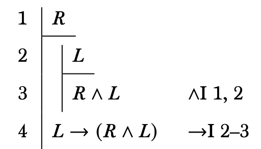
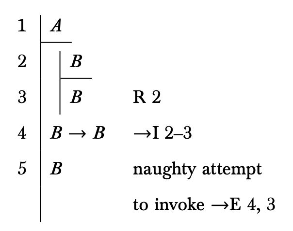
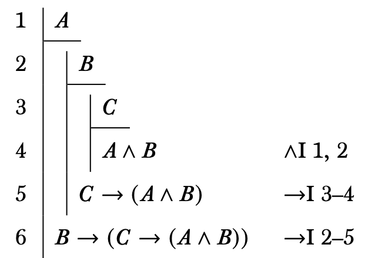
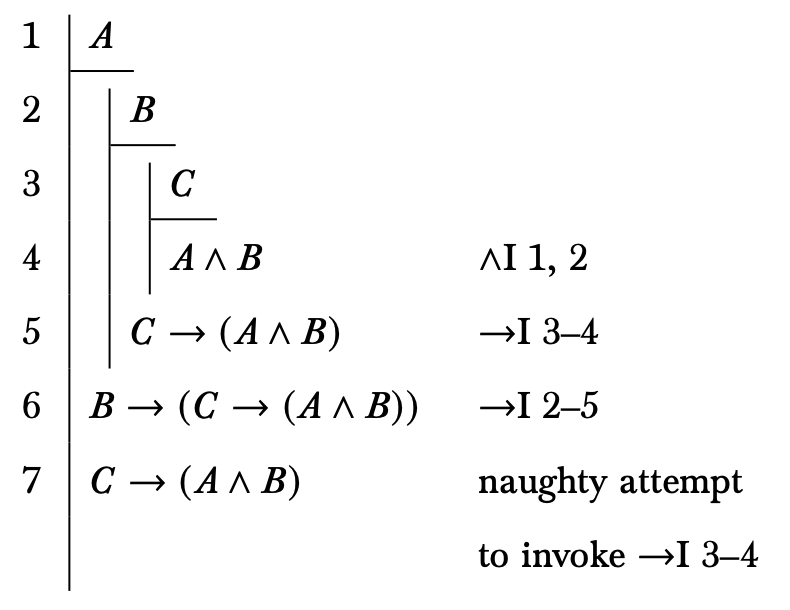
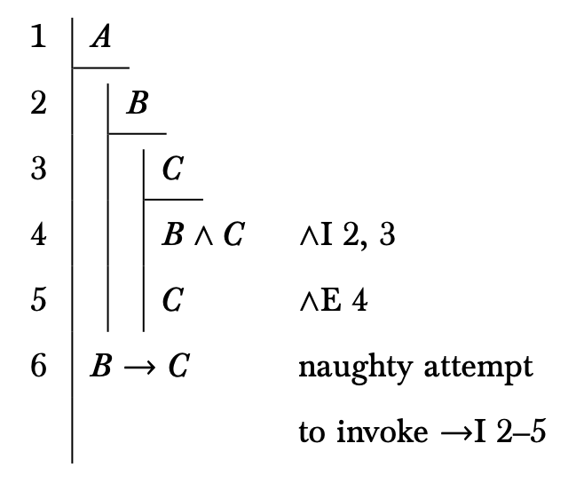

## Plan

This lecture discusses how subproofs work

## Associated Reading

forall x, section 16.5.

## Example of Subproof

::: {.columns align=center}

:::: column

::::

:::: column
- The subproof is the part of the proof that runs from 2 to 3.
- Line 2 introduces a subproof - it is indented, and has a bar under the first line.
::::

:::

## Example of Subproof

::: {.columns align=center}

:::: column

::::

:::: column
Line 3 turns out not to be particularly important - subproofs just end when they end, there isn't anything that makes it stand out as the end.
::::

:::

## Example of Subproof

::: {.columns align=center}

:::: column

::::

:::: column
- What is important is line 4, when we return to the main proof.
- Moving back up one level like this is called **discharging** an assumption (125).
::::

:::

---

::: {.columns align=center}

:::: column

::::

:::: column
When we are still in the subproof, we haven't moved back one step to the left, everything we assert is said to follow both from the premises and from the assumption at the start of the subproof.
::::

:::

---

::: {.columns align=center}

:::: column

::::

:::: column
- Once we close the subproof, we are saying that things follow just from the initial premises.
- That's the sense in which the assumption is discharged.
::::

:::

## Rules on Subproofs

1. Only some very special rules let you appeal to subproofs.
2. Once a subproof is closed, you can't appeal to any part of it, just to the existence of the subproof.
3. You can (typically) only close one subproof at a time.

## What Could go Wrong?!

{height=65%}

## Closing One Subproof at a Time

{height=65%}

## What Could go Wrong?!

{height=65%}

## What Could go Wrong?!

{height=65%}

## Remember

- Once a subproof is closed, you can only appeal to the subproof, not to the lines in it.
- Close subproofs in reverse order to when you open them.
- In any case you'll be doing, just close one at a time.

## For Next Time

We will look at the rules for or.