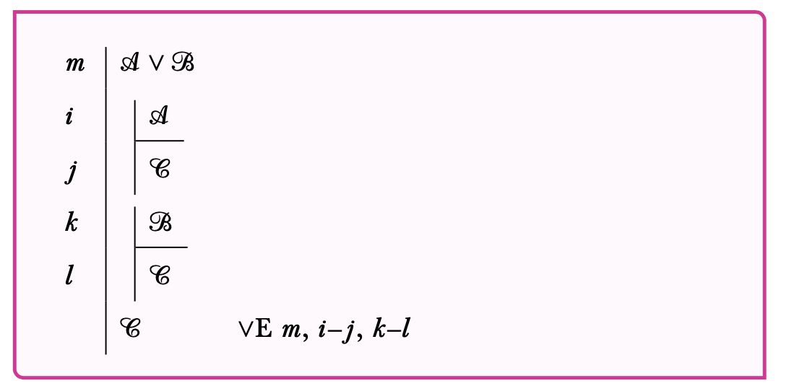
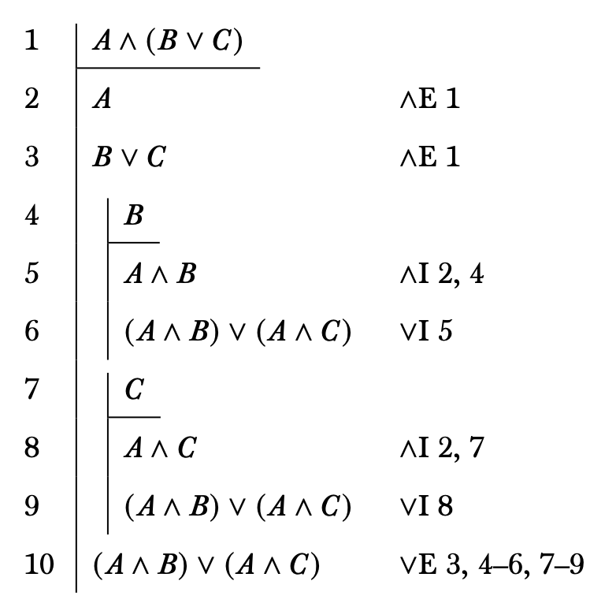

## Plan

This lecture discusses the rules for disjunction.

## Associated Reading

forall x, section 16.7.

## Reasoning to an Or sentence

Imagine we're trying to prove a disjunction, like this one:

- Either Rémy made the soup, or Alfredo made the soup.

There are a lot of ways we could prove this, but the simplest would be to either prove Rémy made the soup, or prove Alfredo made the soup. Either one of those would do.

## Or-Introduction

- Or-introduction, or $\vee$I, is the formal version of the idea behind the last slide.
- It says that if you a sentence, you can add a disjunct either to the left of it or to the right of it.

## Or-Introduction the first

## Or-Introduction the second

## Reasoning from an Or Sentence

Say you have as a premise:

- Either Rémy made the soup, or Alfredo made the soup.

And you want to get to the conclusion:

- The soup is good.

What do you need?

## Two Things

> 1. You need an argument that if Rémy made the soup, it is good; and
> 2. You need an argument that if Alfredo made the soup, it is good.

## Or-Elimination

## Notes on Or Elimination

> - It is hard; you have to do two subproofs.
> - It doesn't always **eliminate** the disjunction; sometimes the C sentence includes a disjunction

---

{height=75%}

---

{height=75%}

## For Next Time

- We will look at the rules for negation.
- Then we will turn to the hard question of how to build these proofs.

