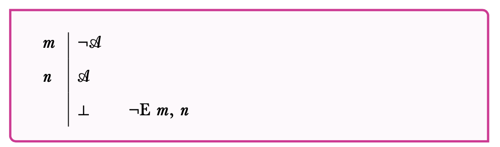
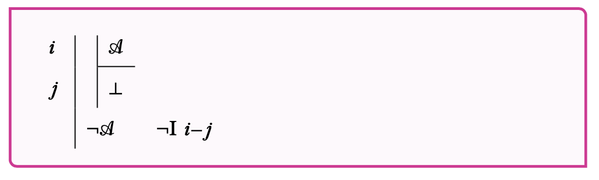
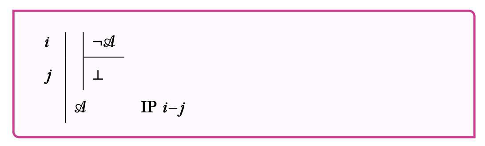
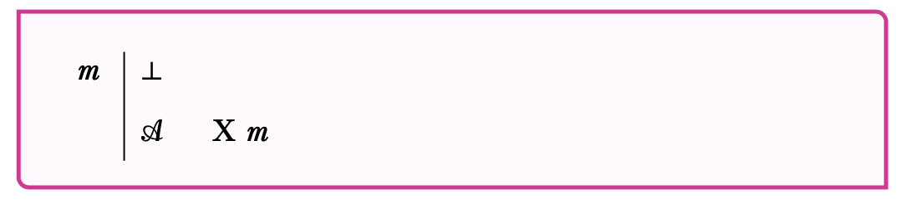

## Plan

This lecture discusses the rules for negation.

## Associated Reading

forall x, section 16.8.

## A New Symbol

- $\bot$

Read this as 'contradiction', or 'the false'. It is a sentence that can't be true.

## Contradiction and Negation

> - How do we know that a contradiction has obtained?
> - By proving some sentence and the negation of that very sentence.
> - This is going to be our rule for proving things from a negation.

## Neg-Elimination

From contradictory sentences, infer $\bot$.

## How to Prove a Negation

Show that if the unnegated part were true, something absurd would follow.

## Absurdity

> - In engineering, a perpetual motion machine, or some other kind of free energy.
> - In finance, a risk-free way to make a guaranteed profit.
> - In logic, a sentence and its negation. 

## Neg-Introduction

- If A implies a contradiction, infer $\neg$A.

## Indirect Proof

- If $\neg$A implies a contradiction, infer A.

## Explosion

- A contradiction implies anything.
- Note that this rule is redundant; we can replicate it using Indirect Proof.
- I think they've added it because it is an interesting rule if you don't like Indirect Proof.

## For Next Time

- That's a lot of rules we've set out.
- We will start looking at how they work in practice.
