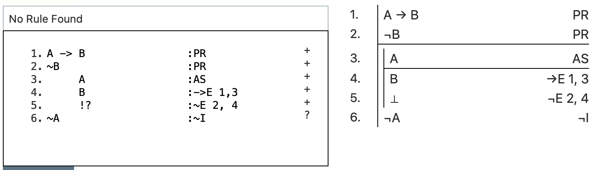

## Plan

This lecture discusses strategies for constructing proofs that involve working backwards.

## Associated Reading

forall x, section 17.1.

## Big Picture

- When you are given a proof to do, you are told what the intended conclusion is.
- That conclusion will usually have a connective in it.
- And when it does, it will often be good to aim to use the introduction rule for that connective to complete the proof.
- Thinking about how that could happen will often give us something to aim for.

## Iteration

- The strategies they discuss in chapter 17 apply recursively.
- Whenever we talk about a 'target' or a 'conclusion', that could be the conclusion of the whole argument, but it does not have to be.
- It could just be something else we've set as a target.

## Working Backwards: And

The $\wedge$I rule says

- From X, and Y, infer X $\wedge$ Y.

So if the last line is a conjunction, one strategy is to aim to prove both parts.

## $A \wedge B, C \vdash (A \wedge C) \wedge (B \wedge C)$

{height=75%}

## $A \wedge B, C \vdash (A \wedge C) \wedge (B \wedge C)$

{height=75%}

## $A \wedge B, C \vdash (A \wedge C) \wedge (B \wedge C)$

{height=75%}

## $A \wedge B, C \vdash (A \wedge C) \wedge (B \wedge C)$

{height=75%}

## $A \wedge B, C \vdash (A \wedge C) \wedge (B \wedge C)$

{height=75%}

## $A \wedge B, C \vdash (A \wedge C) \wedge (B \wedge C)$

{height=75%}

## $A \wedge B, C \vdash (A \wedge C) \wedge (B \wedge C)$

{height=75%}

## $A \rightarrow B \vdash (A \wedge C) \rightarrow (B \wedge C)$

{height=75%}

## $A \rightarrow B \vdash (A \wedge C) \rightarrow (B \wedge C)$

{height=75%}

## $A \rightarrow B \vdash (A \wedge C) \rightarrow (B \wedge C)$

{height=75%}

## $A \rightarrow B \vdash (A \wedge C) \rightarrow (B \wedge C)$

{height=75%}

## $A \rightarrow B \vdash (A \wedge C) \rightarrow (B \wedge C)$

{height=75%}

## $A \rightarrow B \vdash (A \wedge C) \rightarrow (B \wedge C)$

{height=75%}

## $A \rightarrow B \vdash (A \wedge C) \rightarrow (B \wedge C)$

{height=75%}

## $A \rightarrow B, \neg B \vdash \neg A$

{height=75%}

## $A \rightarrow B, \neg B \vdash \neg A$

{height=75%}

## $A \rightarrow B, \neg B \vdash \neg A$

{height=75%}

## $A \rightarrow B, \neg B \vdash \neg A$

{height=75%}

## Working Backwards

- What if the conclusion is a disjunction?
- Don't work backwards!

## For Next Time

- We'll look at strategies that involve going forwards.

