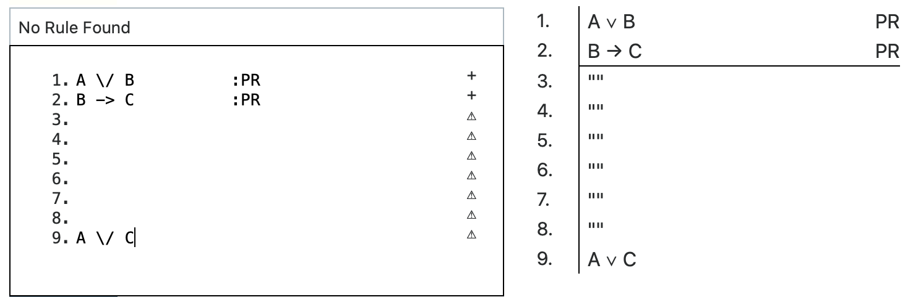
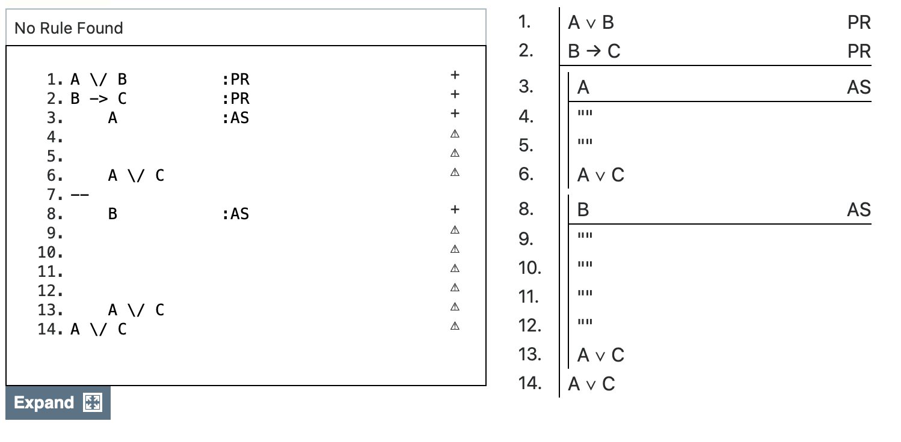
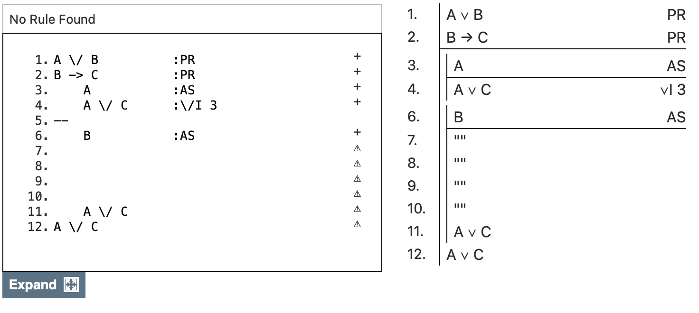
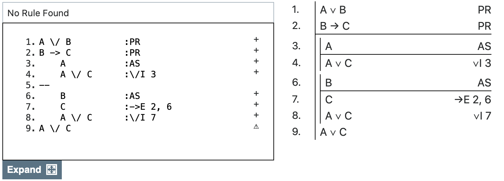
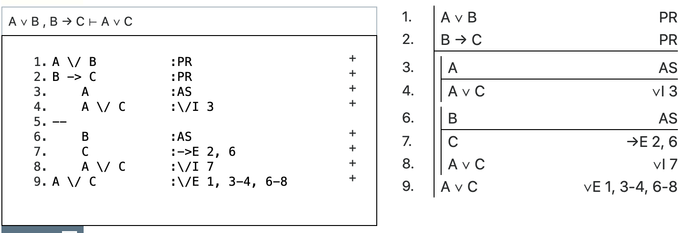
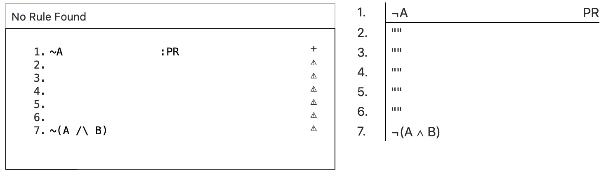
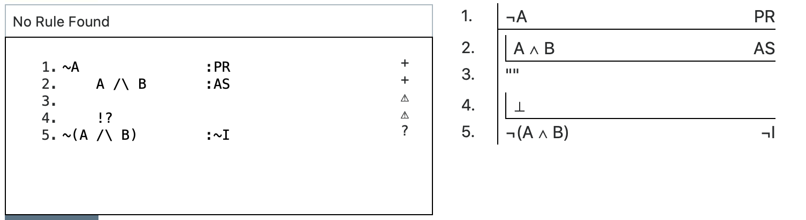
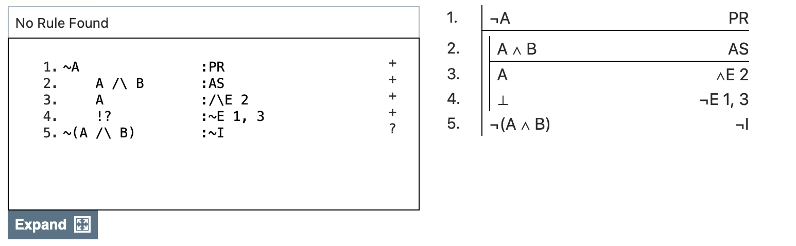
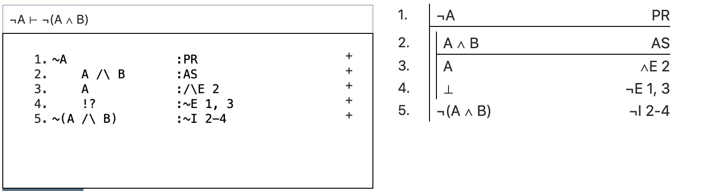

## Plan

This lecture discusses strategies for constructing proofs that involve working forwards.

## Associated Reading

forall x, section 17.2.

## Working Forwards

Big Idea: Plan to use the Elimination rules on the connectives in the premises.

## Simple Illustration: And

When one of the premises is of the form $X \wedge y$, you'll almost certainly need to apply $\wedge$E to get $X$ and $Y$.

## Slightly Trickier: If

> - When one of the premises is of the form $X \rightarrow Y$, you'll almost certainly need to apply $\rightarrow$E.
> - And that means you'll need $X$.
> - But in practice it's hard to tell in advance whether you'll prove $X$, or have it as the start of a subproof, or something else.

## Working forward from Or

When one of the premises is $X \vee Y$ there is a clear(ish) strategy.

1. Find a target conclusion $C$.
2. Do a subproof from $X$ to $C$.
3. Do a subproof from $Y$ to $C$.
4. Conclude $C$ by $\vee$E.

## Working forward from Or

Why clear-ish?

- Because it isn't always true that the target here should be the conclusion of the whole argument.
- Sometimes it is optimal to do a step or two of working backwards first.
- But if you want a simple rule to go by, the best is to do what's on the previous slide with $C$ as the conclusion of the whole argument.

## $A \vee B, B \rightarrow C \vdash A \vee C$

{height=75%}

## $A \vee B, B \rightarrow C \vdash A \vee C$

{height=75%}

## $A \vee B, B \rightarrow C \vdash A \vee C$

{height=75%}

## $A \vee B, B \rightarrow C \vdash A \vee C$

{height=75%}

## $A \vee B, B \rightarrow C \vdash A \vee C$

{height=75%}

## $A \vee B, B \rightarrow C \vdash A \vee C$

{height=75%}

## $A \vee B, B \rightarrow C \vdash A \vee C$

{height=75%}

## Proofs From Disjunctions

- That's the basic structure.
- They are a bit of a pain; I've illustrated almost the easiest one I could find.
- But it's really important to keep track of what your goal is at every point.
- For almost everyone, that's impossible if you try to just start at line 1 and work to line 9.
- You have to bounce forward and backward in these proofs; just like I've done here.

## Working Forward from Not

- It's going to be some kind of proof involving $\bot$.
- Whether that's Indirect Proof or $\neg$E isn't always clear, but that's going to be the structure.

## A Simple Strategy

- If any of the premises is negated, then assume the opposite of the conclusion and try to derive $\bot$.
- If the conclusion is positive, its opposite is adding a negation.
- If the conclusion is already negated, its opposite is deleting the negation.

## A More Complicated Strategy

- Sometimes the simple strategy won't be optimal.
- Sometimes it will be quicker to do some working forward from the other premises, or backwards from the conclusion.
- But the simple strategy is going to work, even in those cases.

## $\neg A \vdash \neg (A \wedge B)$

{height=75%}

## $\neg A \vdash \neg (A \wedge B)$

{height=75%}

## $\neg A \vdash \neg (A \wedge B)$

{height=75%}

## $\neg A \vdash \neg (A \wedge B)$

{height=75%}

## For Next Time

- I'll end with two special techniques