## Plan

This lecture looks at two tricky cases, and how the proofs for them work.

## Associated Reading

forall x, chapter 17.

## Disjunctive Syllogism

1. $A \vee B$
2. $\neg A$
3. So, $B$

That looks pretty good; let's try proving it.

## $A \vee B, \neg A \vdash B$

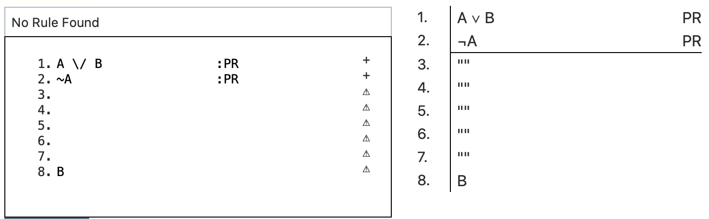{height=75%}

## $A \vee B, \neg A \vdash B$

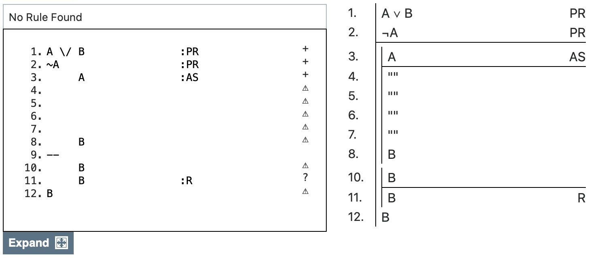{height=75%}

## $A \vee B, \neg A \vdash B$

{height=75%}

## $A \vee B, \neg A \vdash B$

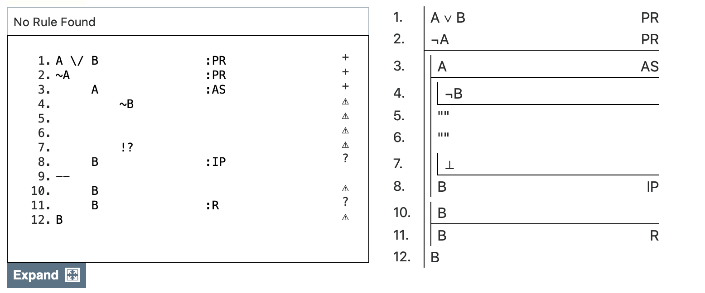{height=75%}

## $A \vee B, \neg A \vdash B$

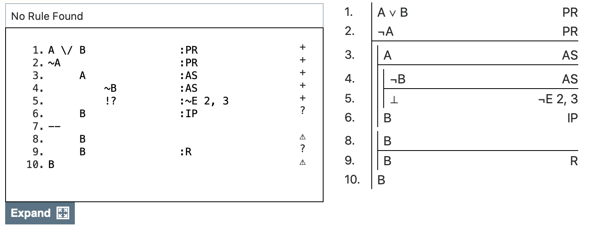{height=75%}

## $A \vee B, \neg A \vdash B$

{height=75%}

## $A \vee B, \neg A \vdash B$

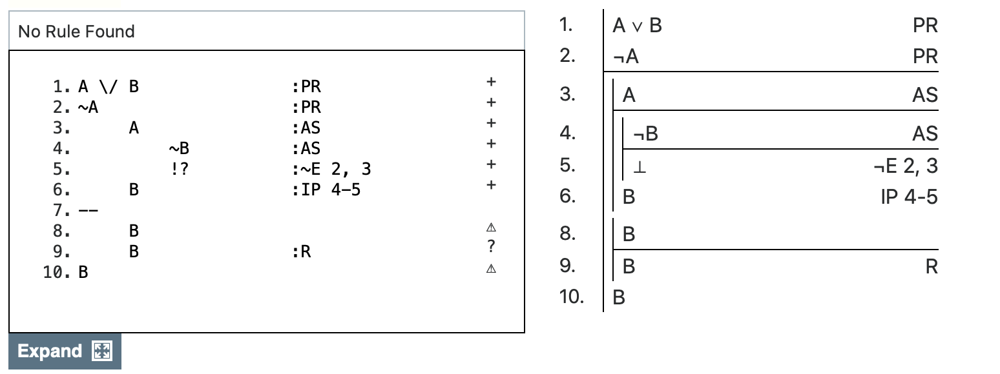{height=75%}

## $A \vee B, \neg A \vdash B$

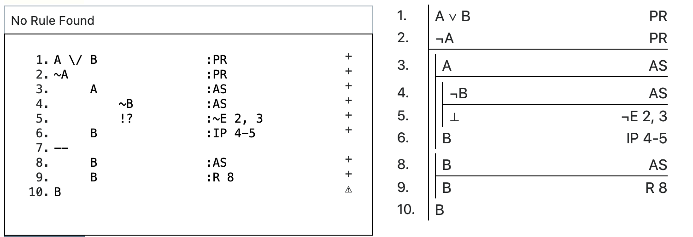{height=75%}

## $A \vee B, \neg A \vdash B$

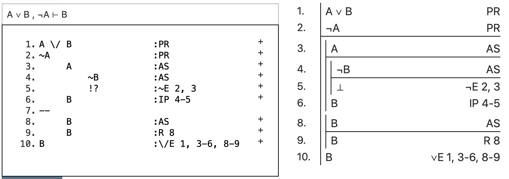{height=75%}

## Second example

$\vdash A \vee \neg A$

## How to prove things from zero premises

1. If they are a conditional, set up $\rightarrow$I. The left hand side will work just like a premise.
2. If they are not a conditional, go for Indirect Proof.

## $\vdash A \vee \neg A$

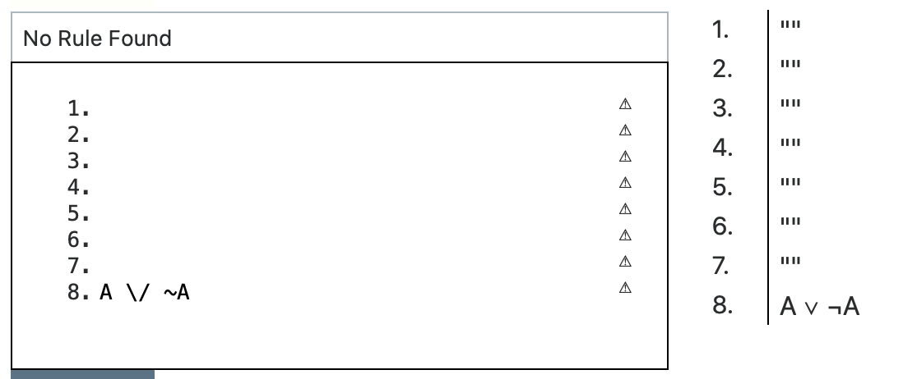{height=75%}

## $\vdash A \vee \neg A$

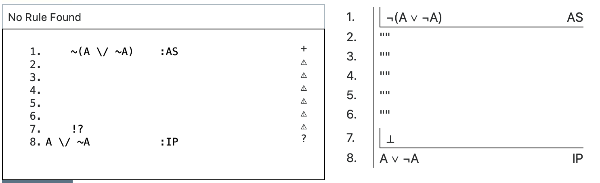{height=75%}

## $\vdash A \vee \neg A$

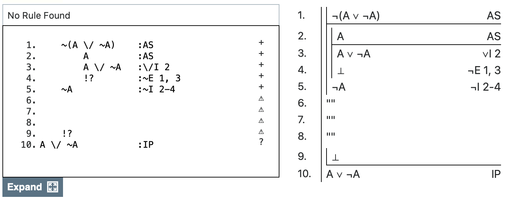{height=75%}

## Negated Disjunctions

- The move from the previous slide is more or less compulsory.
- The only way to get something out of $\neg(X \vee Y)$ is to assume $X$, get a contradiction (via deriving $X \vee Y$), and then use $\neg$I to get $\neg X$.
- It's a pain, and it's just a move you have to learn.
- It might be my single least favorite part of this system.

## $\vdash A \vee \neg A$

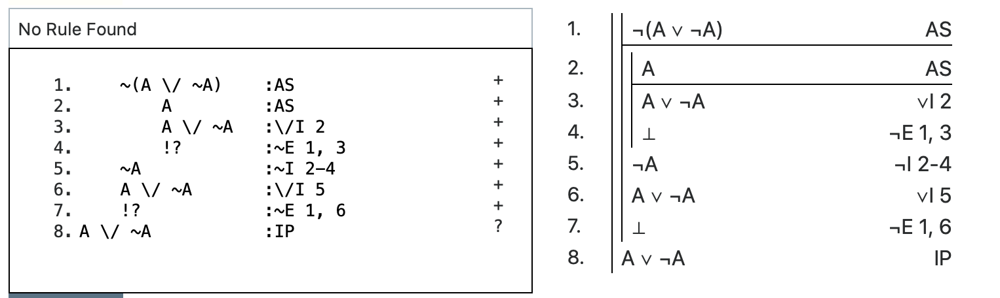{height=75%}

## $\vdash A \vee \neg A$

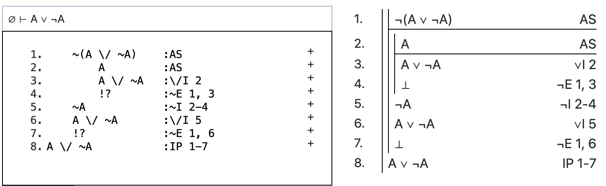{height=75%}

## Challenge Problem

1. Prove $\vdash ((A \rightarrow B) \rightarrow A) \rightarrow A$
2. See if you can complete that proof in under 25 lines.

That one, like $\vdash A \vee \neg A$, is a sign that the strategies in 17.1 and 17.2 work 98% of the time, but not 100% of the time.

## For Next Time

No recorded lectures next week. We'll just go over the proofs in the weekly assignment, and do some revision.