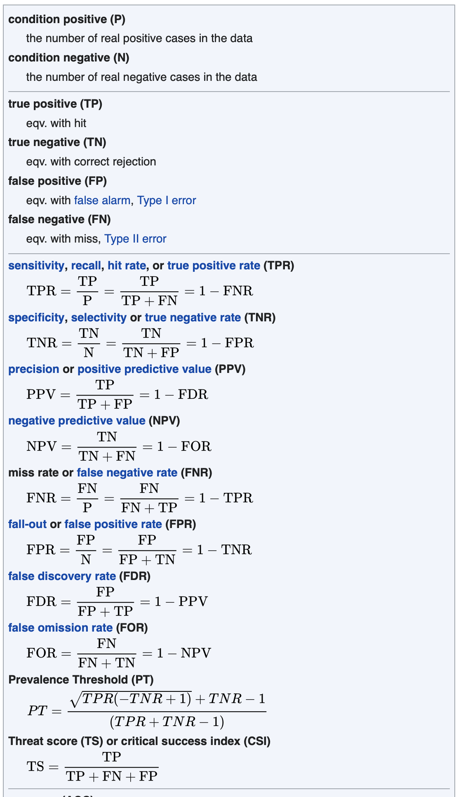

## Plan

- This lecture talks about how and when you can flip conditional probabilities around.

## Associated Reading

Odds and Ends, chapter 8 

- Note I'm going to start with a somewhat different approach to these problems, before ending up in the same place as the book.
- Very roughly, I'm going to cover the contents of chapter 8 in reverse order, so we'll end up at 8.1 in a few lectures time.

## A Real World Problem

- Imagine that 3% of men have disease D. 
- A man you know has no special reason to think he's vulnerable to D, it's not like all his male ancestors had D, but no special reason to think he's immune to it either.
- There is a test for whether one has disease D or not. 
- Among people who have the disease, 90% test positive. 
- But only 5% of those who do not have the disease test positive.$\pause$

This man just had the test, and it came back positive. What is the probability that he has disease D?

---

## How To Solve These Problems

- Start with a table with the states of the world on one axis, and states of the test on the other axis.
- In this case it can just be a 2*2 table.
- In each cell, write down the initial probability of ending up in that cell.
- That will be the probability of being in that state, times the probability of that test result given that you are in that state.
- The formula we are constantly using here is $Pr(A \wedge B) = Pr(A) Pr(B | A)$.

## The Table

|  | Test Positive | Test Negative |
| --	| -------------	| -------------	|
| Have Disease | 0.027 | 0.003 |
| No Disease | 0.0485 | 0.9215 |

$\pause$

Let's talk for a bit about how we generated it.

## The Table

|              | Test Positive | Test Negative |
| -----------: | :-----------: | :-----------: |
| Have Disease |   0.027       |   0.003       |
| No Disease   |   0.0485      |   0.9215      |

- Focus on the top left cell. Why does it say 0.027?
- Well, probability of disease is, we said, 0.03. 
- And probability of test positive given disease is 0.9.
- So probability of disease and test positive is 0.03 * 0.9 = 0.027, or 2.7%.

## The Table

|              | Test Positive | Test Negative |
| -----------: | :-----------: | :-----------: |
| Have Disease |   0.027       |   0.003       |
| No Disease   |   0.0485      |   0.9215      |

- Now focus on the top right cell. Why does it say 0.003?
- Well, probability of disease is, we said, 0.03. 
- And probability of test negative given disease is 1 - 0.9, i.e., 0.1.
- So probability of disease and test positive is 0.03 * 0.1 = 0.003, or 0.3%.

## The Table

|              | Test Positive | Test Negative |
| -----------: | :-----------: | :-----------: |
| Have Disease |   0.027       |   0.003       |
| No Disease   |   0.0485      |   0.9215      |

- Now focus on the bottom left cell. Why does it say 0.0485?
- Well, probability of disease is, we said, 0.03. 
- So probability of non-disease is 0.97.
- And probability of test positive given non-disease is 0.05.
- So probability of non-disease and test positive is 0.97 * 0.05 = 0.0485, or 4.85%.

## The Table

|              | Test Positive | Test Negative |
| -----------: | :-----------: | :-----------: |
| Have Disease |   0.027       |   0.003       |
| No Disease   |   0.0485      |   0.9215      |

- Now focus on the bottom right cell. Why does it say 0.9215?
- Well, probability of non-disease is 0.97.
- And probability of test negative given non-disease is 1 - 0.05 = 0.95.
- So probability of non-disease and test positive is 0.97 * 0.95 = 0.9215, or 92.15%.

## Solving the Problem

|              | Test Positive | Test Negative |
| -----------: | :-----------: | :-----------: |
| Have Disease |   0.027       |   0.003       |
| No Disease   |   0.0485      |   0.9215      |

- We want to know Pr(Disease $|$ Test Positive). Call this $Pr(D | TP)$.$\pause$
- That's $Pr(D \wedge TP)$ divided by $Pr(TP)$.$\pause$
- And $Pr(D \wedge TP)$ is 0.027.$\pause$
- And $Pr(TP)$ is 0.0755.$\pause$
- So the answer is roughly 0.35, i.e., $\frac{0.027}{0.0755}$.

## Practical Consequence

- That test looked pretty reliable.
- But testing positive only raises the probability of having the disease toa bit over 1 in 3.
- This wasn't really a quirk of the example.
- When testing for relatively rare conditions, this is a really common situation.
- Unless the test is **really** reliable, testing positive is worrying, but usually raises the dreaded probability to well under 1, often under 0.5.

## General Strategy For A/B Problems

- Make a 2 x 2 table, with $A, \neg A$ on the rows, and $B, \neg B$ on the columns.
- Work out the probability of each cell.
- To do this, repeatedly use the formula

$$
\Pr(X \wedge Y) = \Pr(X | Y)\Pr(Y)
$$

- Add up the values across the rows to get $\Pr(A), \Pr(\neg A)$.
- Add up the values down the columns to get $\Pr(B), \Pr(\neg B)$.
- Use the formula for conditional probability to work out the answer.

## Another Example

- $\Pr(A) = 0.6$.
- $\Pr(B | A) = 0.3$.
- $\Pr(B | \neg A) = 0.8$.
- Find $\Pr(B)$ and $\Pr(A | B)$.

## Use the Negation Rule to fill in the Basic Probabilities

- $\Pr(A) = 0.6$, so $\Pr(\neg A) = 0.4$. \pause
- $\Pr(B | A) = 0.3$, so $\Pr(\neg B | A) = 0.7$. \pause
- $\Pr(B | \neg A) = 0.8$, sp $\Pr(\neg B | \neg A) = 0.2$.

## Build the Table

|        |  $B$   |   $\neg B$  |
|-------:|:------:|:-----------:|
|$A$     |        |             |
|$\neg A$|        |             |

## Top Left Corner

\begin{align*}
\Pr(A \wedge B) &= \Pr(B | A) \Pr(A) \\
 &= 0.3 \times 0.6 \\
 &= 0.18
\end{align*}

\pause

|        |  $B$   |   $\neg B$  |
|-------:|:------:|:-----------:|
|$A$     |  0.18  |             |
|$\neg A$|        |             |

## Top Right Corner

\begin{align*}
\Pr(A \wedge \neg B) &= \Pr(\neg B | A) \Pr(A) \\
 &= 0.7 \times 0.6 \\
 &= 0.42
\end{align*}

\pause

|        |  $B$   |   $\neg B$  |
|-------:|:------:|:-----------:|
|$A$     |  0.18  |   0.42      |
|$\neg A$|        |             |

## Check

|        |  $B$   |   $\neg B$  |
|-------:|:------:|:-----------:|
|$A$     |  0.18  |   0.42      |
|$\neg A$|        |             |

The numbers in the top row are 0.18 + 0.42 = 0.6, which is what we were told $\Pr(A)$ was. So our work passes this little cross-check.

## Bottom Left Corner

\begin{align*}
\Pr(\neg A \wedge B) &= \Pr( B | \neg A) \Pr(\neg A) \\
 &= 0.8 \times 0.4 \\
 &= 0.32
\end{align*}

\pause

|        |  $B$   |   $\neg B$  |
|-------:|:------:|:-----------:|
|$A$     |  0.18  |   0.42      |
|$\neg A$|  0.32  |             |

## Bottom Right Corner

\begin{align*}
\Pr(\neg A \wedge \neg B) &= \Pr( \neg B | \neg A) \Pr(\neg A) \\
 &= 0.2 \times 0.4 \\
 &= 0.08
\end{align*}

\pause

|        |  $B$   |   $\neg B$  |
|-------:|:------:|:-----------:|
|$A$     |  0.18  |   0.42      |
|$\neg A$|  0.32  |   0.08      |

## Check

|        |  $B$   |   $\neg B$  |
|-------:|:------:|:-----------:|
|$A$     |  0.18  |   0.42      |
|$\neg A$|  0.32  |   0.08      |

- The bottom row sums to 0.4, as we knew $\Pr(\neg A)$ was.
- And the whole thing sums to 1, which is good.

## $\Pr(B)$

|        |  $B$   |   $\neg B$  |
|-------:|:------:|:-----------:|
|$A$     |  0.18  |   0.42      |
|$\neg A$|  0.32  |   0.08      |

- $\Pr(B) = 0.18 + 0.32 = 0.5$. \pause
- $\Pr(\neg B) = 0.42 + 0.08 = 0.5$ \pause
- Given $\Pr(B)$ we could have used the negation rule to work out $\Pr(\neg B)$.

## $\Pr(A | B)$

\begin{align*}
\Pr(A | B) &= \frac{\Pr(A \wedge B)}{\Pr(B)} \\
 &= \frac{0.18}{0.5} \\
 &= 0.36
\end{align*}

- So the answer is that $\Pr(A | B)$ is 0.36.
- If you learn $B$, the probability of $A$ falls from 0.6 to 0.36.

## For Next Time

- We will revise the rules of probability, with special focus on the rules that you use to solve these kinds of problems.
