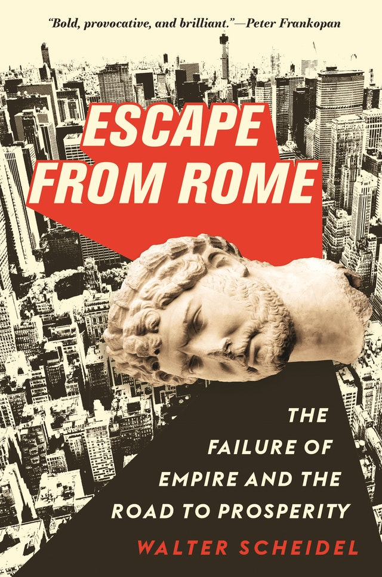
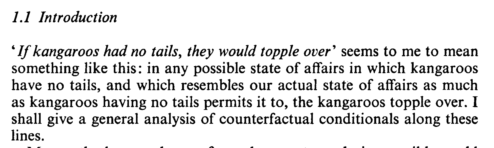

## Plan

- To introduce our last topic, counterfactual conditionals.

## Associated Reading

- Boxes and Diamonds, chapter 7.

## Counterfactuals in Philosophy

These play a central role in lots of fields, including

- Causation
- Explanation
- Evaluation
- Planning

## Causation

There feel like there is a close connection between these claims.

- Causal event C caused effect event E.
- If C hadn't happened, E wouldn't have happened.

It's not a foolproof connection - maybe E would have happened some other way. But there is a link.

## Explanation

It also feels like there is a close connection between these claims.

- Historical fact H explains event to be explained E.
- If H hadn't happened, E wouldn't have happened.

Again, there are exceptions in both directions. But there is a link there.

## Evaluation

Let's do a real-life example. What's wrong with this reasoning?

{height=60%}

## Evaluation

This tweet compares the following things.

1. How much damage was actually caused by coronavirus.
2. How much damage was actually caused by the lockdown.

## Evaluation

But if you want to evaluate the lockdown, you need to compare these two factors

1. How much damage **would have been** caused by coronavirus without a lockdown.
2. How much damage was actually caused by the lockdown.

That is, you need a counterfactual. I can't say what the value of that would be - it's miles outside my expertise. But I can tell you that the comparison here is just wrong.

## Planning

If you are trying to decide between two options A and B, it feels like these are the questions you need to answer.

1. If I were to do A, what would happen?
2. If I were to do B, what would happen?

That is, you need to answer two questions about counterfactuals.

## History

{height=70%}

Part of what makes this provocative is that Prof Scheidel is doing what philosophers think is obvious, using counterfactuals to provide evidence about explanation.

## Coincidence

- But Scheidel isn't just interested in explanation.
- He's also interested in which facts about history are coincidences, and which are not. \pause
- In particular, is is a coincidence that since the fall of Rome, there has not been a large empire in Europe that has lasted more than a few years.
- This is a striking contrast to the many empires that have arisen in South Asia, East Asia and the Americas.

## Two Ways to Answer that Question

> 1. Is there something that could easily have happened such that if it had happened, there would have been a long lasting empire in Europe?
> 2. Is there a very similar world to ours in which there is a long lasting empire in Europe?

## Two Ways to Answer that Question

1. Is there something that could easily have happened such that if it had happened, there would have been a long lasting empire in Europe?
2. Is there a very similar world to ours in which there is a long lasting empire in Europe?

Intuition: These are sort of the same question.

## David Lewis

## Next Time

We'll work on turning this intuition of Lewis's into a theory.